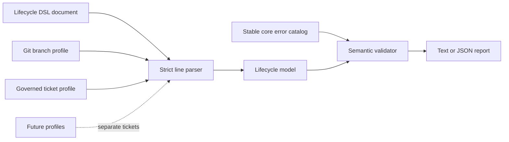

# Architecture

The project separates a domain-neutral lifecycle contract from domain profiles.
The validator never imports Git, ticket, deployment, or service implementations.

## Boundaries

- `spec/` defines the public language contract.
- `src/lifecycle.py` parses, validates, and renders diagnostics.
- `errors/` defines stable validator diagnostics.
- `profiles/` contains portable domain definitions, not executable adapters.
- `tests/` proves syntax, graph, error-binding, and profile invariants.

Runtime orchestration and mutations stay outside this repository. A consumer
may use a validated model to plan an operation, but this validator does not
authorize or execute that operation.
