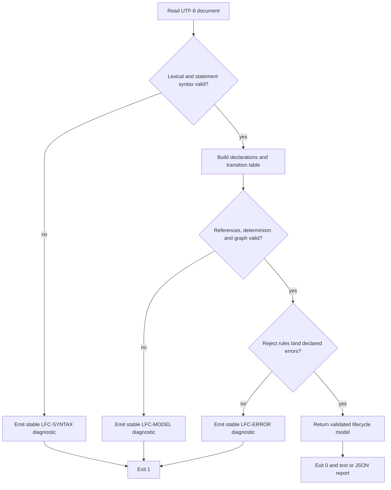

# Logic flow

Validation is deterministic and fail-closed. No partial model becomes valid.

The validator collects independent diagnostics in source order, then sorts the
final report by line and stable code. Unexpected internal failures use exit 2
and are never reported as a valid lifecycle.
